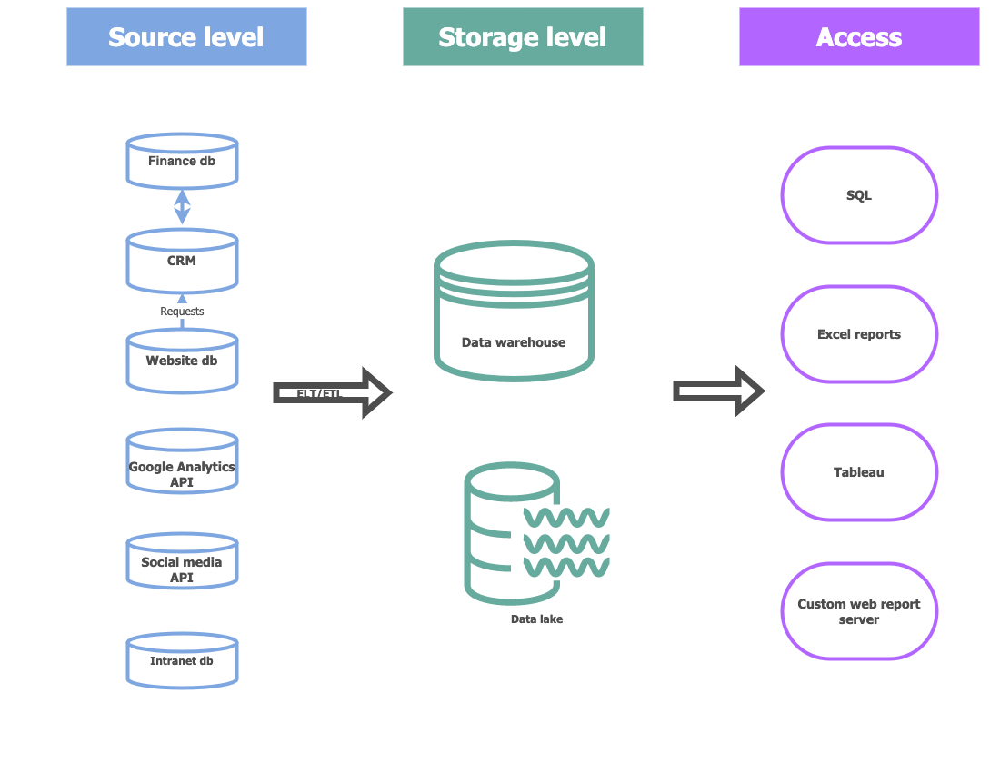

# Модуль 1

Вместо вступления. Я достаточно большая зануда, поэтому уже очень долго ковыряю Git (кстати, на заре ковыряния я там сделала pull request в репозиторий курса - поправила там несколько пунктуационных и пару орфографических недочётов по старой вычитывательной привычке, пока никто не замерджил этот пул реквест). 

Ещё так и не поняла, в чём преимущества пушить в Git с локальной машины. Я настойчиво делаю это через Visual Studio/ CLI, дабы привыкнуть к ним, но пока так и не поняла, в чём бонус. Мне, возможно, даже проще это делать в лоб через браузер (ну разве что нет превью side by side, но у меня хорошее воображение)). Или то главным образом, чтобы привыкнуть к CLI?

## Архитектура аналитического решения

Набросала примерную схему на основе своего опыта в роли руководителя отдела Marketing Communications международной компании, которая производит морскую электронику (B2B бизнес). Там я немного сталкивалась с частью источника данных и доступа к ним. Не уверена, был ли вообще центральный слой хранения данных (есть ощущение, что не было). Хотелось бы более детально проработать часть про потоки данных, тем более, что несколько источников данных интегрированы между собой, но на этой стадии изучения курса мне пока ещё вовсе непонятно, что надо делать с серединой с учётом задач компании. 

## Аналитика в Excel

