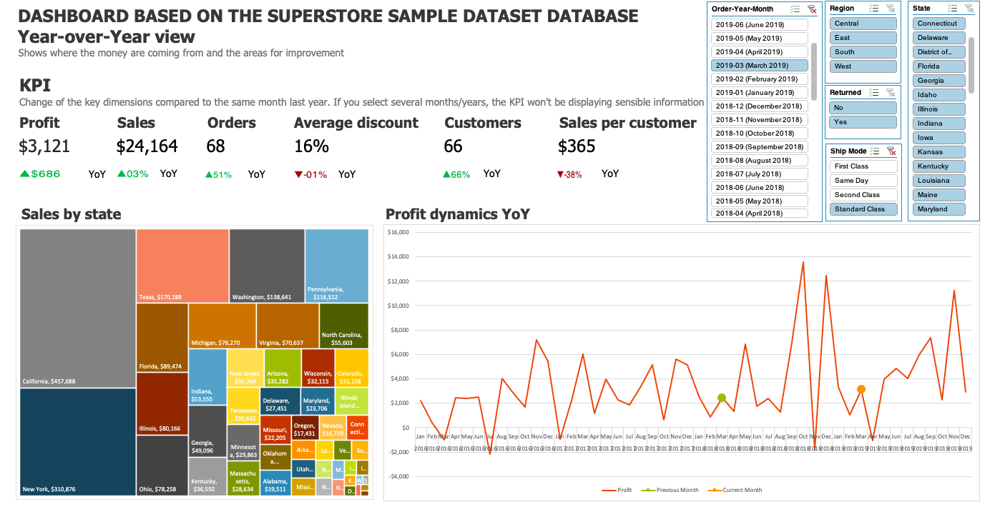
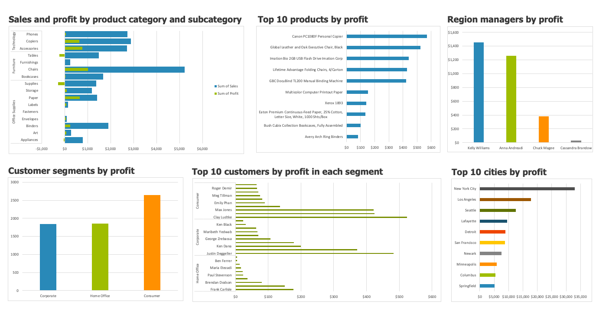
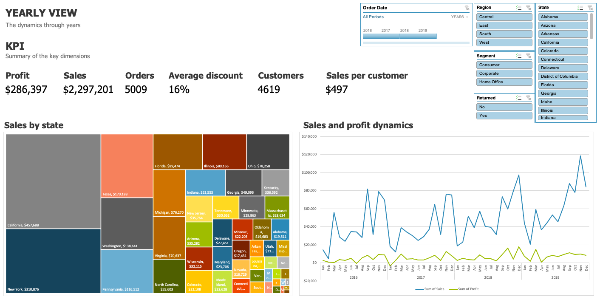
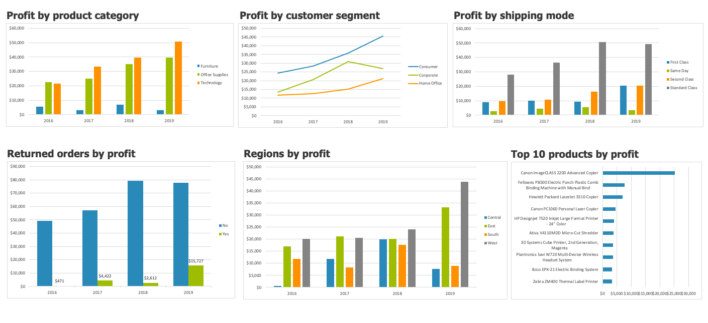

# Модуль 1

Вместо вступления. Я достаточно большая зануда, поэтому уже очень долго ковыряю Git (кстати, на заре ковыряния я там сделала pull request в репозиторий курса - поправила несколько пунктуационных и пару орфографических недочётов по старой вычитывательной привычке, но пока никто не замерджил этот пул реквест). 

Не сразу поняла, в чём преимущества пушить в Git с локальной машины. Я сходу настойчиво делала это через Visual Studio/ CLI (что я, зря что ли курс прошла)), дабы привыкнуть к ним, в итоге дошло :).

## Архитектура аналитического решения

Набросала примерную схему на основе своего опыта в роли руководителя отдела Marketing Communications международной компании, которая производит морскую электронику (B2B бизнес). Там я немного сталкивалась с частью источника данных и доступа к ним. Не уверена, был ли вообще центральный слой хранения данных (есть ощущение, что не было). Хотелось бы более детально проработать часть про потоки данных, тем более, что несколько источников данных интегрированы между собой, но на этой стадии изучения курса мне пока ещё вовсе непонятно, что надо делать с серединой с учётом задач компании. 

## Аналитика в Excel

Вообще, я думала, что плюс-минус нормально знаю эксель, в своё время делала дашборды с историей продаж (так называемые reference lists), хотя так и не дошла до нормальной их автоматизации. Но тут я посмотрела [видео Николая Валиотти](https://www.youtube.com/watch?v=rxu8jmsvw98&feature=youtu.be), ну и захотелось внедрить всё то же самое. Собственно, что я и сделала. Правда, пока ковыряла незнакомые для себя функции и натыкалась на эксельные баги (об этом ниже), не осталось сил на нормальную структуру дашборда с точки зрения исполняемой функции. Если буду это всё включать в своё портфолио, буду ещё переделывать и допиливать баги (кстати, некоторые есть и в файле Николая). 

Но теперь по порядку.

Для начала комментарий по поводу [Пошаговой инструкции](https://github.com/Data-Learn/data-engineering/blob/master/DE-101%20Modules/Module01/DE%20-%20101%20Lab%201.1/build_steps_dashboard.md), пункт 2. На текущий момент в MS Office 365 появилась функция XLOOKUP, которая смотрит столбцы в любой последовательности, так что при наличии Office 365, танцы с бубном вокруг VLOOKUP необязательны. 

### Вид Year-over-Year (сравнение месяца с аналогичным месяцем предыдущего года)

Несмотря на кажущуюся сложность, решения достаточно простые (мне такое всегда очень нравится). 
Баги, с которыми я столкнулась и которые пока не придумала, как решить:
1. если пробовать использовать в сводной таблице вычисляемое поле show data as % difference from previous year, в случае наличия отрицательного числа в предыдущем году, будет косяк. Эксель будет делить на отрицательное число, а не брать по модулю. Соответственно, если в предыдущем году была убыль, а в следующем - прибыль, результат будет тем не менее падением прибыли, а не ростом, как должно бы.
В общем, я решила выводить разницу не в процентах, а просто разницу. 

2. При выборе некоторых штатов (то ли с отсутствующими данными о продажах в некоторых месяцах, то ли ещё по какому принципу, не хватило терпения доковырять), сводная таблица с динамикой прибыли будет строить нулевые значения с 1900 годом в конце таблицы. 

3. При выборе какого-то фильтра график продаж и прибыли в зависимости от категории и подкатегории продукта автоматически достраивает вторую второстепенную ось, и, соответственно, всё едет. Фиксится удалением этой самой оси. 

В остальном, вроде бы работает норм. 

###Yearly view

Всё-таки, некоторые показатели хочется смотреть в бОльшем масштабе, чем месяц. Поэтому сделала ещё вид с трендами по годам. Тут вроде бы без неожиданностей.

