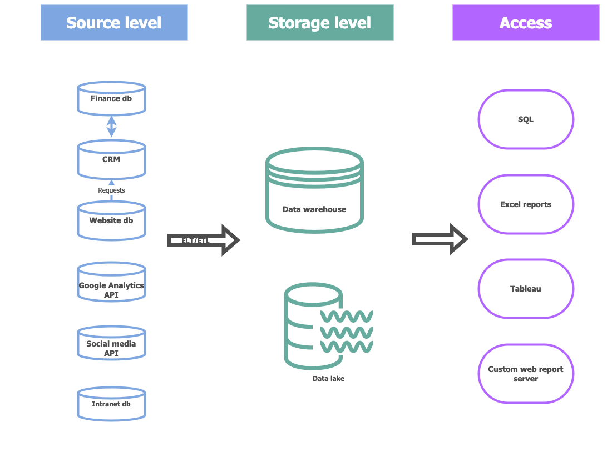

# Модуль 1

## Архитектура аналитического решения

Набросала примерную схему на основе своего опыта в роли руководителя отдела Marketing Communications компании, которая производит морскую электронику. Там я немного сталкивалась с правой и левой частью. Не уверена, был ли вообще центральный слой хранения данных (есть ощущение, что не было). Хотелось бы более детально проработать часть про потоки данных, но на этой части курса мне пока ещё вовсе непонятно, что надо делать с серединой с учётом задач компании. 

