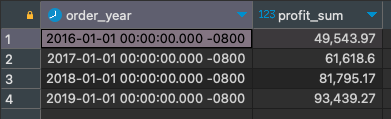

# Модуль 2

Изначально хотела пройти этот модуль с минимальными знаниями SQL, которые успела нахватать не вполне последовательно, решая упражнения на https://sql-ex.ru/ (на момент ноября 2022 года знаний по SQL был ноль). Но, уткнувшись во что-то в установке DBeaver (причём, уже не знаю, что не взлетело, так как потом без проблем всё подключила), решила, что нужна хотя бы чуть более основательная база (странная логика, я знаю)). 

Прошла 2 c небольшим модуля [курса по SQL](https://datalearn.ru/kurs-po-sql) тут же на Datalearn. Очень крутой курс, спасибо большое ребятам! Дополировала [интерактивным тренажёром на Stepik](https://stepik.org/course/63054/), чуть лучше некоторые вещи уложились в голове. Планирую добить до конца оба курса, но пока решила разнообразить другими задачами. И ещё поняла, что надо почитать или пройти курс на английском, чтобы не плавать в терминологии на английском.

В процессе курса Анатолия немного потрогала pgAdmin, сейчас погоняла DBeaver. 

Для загрузки данных из БД Superstore использовала готовые sql файлы из [datalearn репозитория](https://github.com/Data-Learn/data-engineering/tree/master/DE-101%20Modules/Module02/DE%20-%20101%20Lab%202.1). Сразу же изменила тип данных в postal_code на varchar, иначе потом криво добавляется недостающий индекс (исчезает первый ноль). Скрипт Returns аналогично тому, что Дима показывал в видео, редактировала на ходу, причём два раза, оба забыла сохранить, чтобы предложить правки в курс. Но вообще, если честно, так даже по-моему эффективнее тренировать.

## 1. SQL ЗАПРОСЫ НА ОСНОВЕ ЭКСЕЛЕВСКОГО ДАШБОРДА

### 1.1 Считаем KPI
Решила повторить то, что [делала в экселе в первом модуле](https://github.com/Bigdataworm/Datalearn/blob/main/DE-101/Module1/Readme.md).

C SQL получилось решить то, что не получалось красиво сделать в экселе (до некрасивого решения я так и не добралась)). В экселе я для подсчёта процента роста/уменьшения прибыли и других показателей использовала вычисляемое поле сводной таблицы, которое по неизвестным мне причинам знаменатель берёт не по модулю, таким образом расчёт получается в корне неправильным в том случае, если к примеру была отрицательная прибыль. В общем, с SQL это всё решается просто.

Решила использовать оконные функции и CTE, пока до конца не разобралась, что лучше: две CTE или CTE и подзапрос, как у меня получилось случайно (но потом уже не стала переделывать), хотя с двумя CTE по-моему как минимум читается проще.

#### 1.1.1. Прибыль по месяцам в сравнении с аналогичным месяцем предыдущего года (Year-over-year) 

```sql
/*Profit per month compared to the same month of the previous year (Year over year comparison)*/

-- calculating profit by month and extracting year and month from the order date for using  
-- in join clause in the main SELECT statement.

with current_year AS
	(select 
		date_part('year', order_date) as order_year,
		date_part('month', order_date) as order_month,
		to_char(order_date, 'YYYY-MM') as order_year_month,
		sum(profit) over(partition by to_char(order_date, 'YYYY-MM')) as current_profit
	from 
		public.orders)
		
select
	current_year.order_year_month,
	ROUND(current_year.current_profit, 2) as current_profit,
	ROUND(prev_year.prev_profit, 2) as prev_profit,
	ROUND((current_year.current_profit / prev_year.prev_profit - 1) * 100) as percent_diff
from
	current_year
-- join data from CTE with the same table (from subquery) but using year-1
left join
	(select
		date_part('year', order_date) as order_year,
		date_part('month', order_date) as order_month,
		to_char(order_date, 'YYYY-MM') as order_year_month,
		SUM(profit) over(partition by to_char(order_date, 'YYYY-MM')) as prev_profit	
	 from 
	 	public.orders) as prev_year
ON 
	prev_year.order_year = current_year.order_year - 1 
	and
	prev_year.order_month = current_year.order_month
group by 
	current_year.order_year_month,
	current_year.current_profit,
	prev_year.prev_profit
order by
	1,2;
```


Другие KPI считаются аналогично, просто заменяем названия столбцов и функцию агрегирования в основном селекте. Я для разнообразия немного разными способами написала запросы.
 
 #### 1.1.2. Изменение KPI по годам
 
```sql
--Yearly KPI change, change is shown in percent

SELECT
	year,
	ROUND(SUM(profit), 1) AS profit,
	ROUND((SUM(profit) / LAG(SUM(profit)) OVER w - 1) * 100, 1) AS profit_change,
	ROUND(SUM(sales), 1) AS sales,
	ROUND((SUM(sales) / LAG (SUM(sales)) OVER w - 1) * 100, 1) AS sales_change,
	COUNT(distinct order_id) AS orders,
	ROUND((count(distinct order_id)::numeric / LAG(count(distinct order_id)::numeric) OVER w - 1) * 100, 1) AS orders_change,
	ROUND(SUM(profit)/SUM(sales) *100, 1) AS profit_margin,
	ROUND(((SUM(profit)/SUM(sales)) / LAG(SUM(profit)/SUM(sales)) OVER w - 1) * 100, 1) AS profit_margin_change
FROM
    (
	SELECT
        date_part('year', order_date) AS year,
        profit,
        sales,
        order_id
    FROM
        public.orders
    ) subquery
GROUP BY
    year
WINDOW w AS (ORDER BY year)
ORDER BY
    year;
```


### 1.2 Смотрим остальные показатели 
В разных запросах потренировала разные фильтры/группировки, так надо от конкретной задачи отталкиваться, конечно.

#### 1.2.1 Упущенная прибыль по штатам (смотрим продажи, где заказ был отменён)
```sql
/* Lost profit. Returned orders by state */

select
	state,
	SUM(sales) as returned_sales_sum,
	COUNT(returned) as returned_order_count
from
	public.orders as o
join
	(select
		distinct order_id,
		returned
	from
		public."returns") as r
on o.order_id = r.order_id
group by
	state,
	r.returned
order by
	returned_sales_sum desc;
```


#### 1.2.2 Динамика прибыли
```sql
/* Profit dynamics */
select
	date_part('year', order_date) as order_year,
	--to_char(order_date, 'YYYY-MM') as order_year_month,
	ROUND(sum(profit), 2) as profit_sum
from 
	public.orders
group by 
	order_year	
	--order_year_month
order by
	order_year;		
```


####  1.2.3 Топ-10 продуктов по прибыли
```sql
/* Top 10 product by profit */
select
	product_name,
	ROUND(SUM(profit), 2) as profit_sum
from
	public.orders
group by
	product_name,
	orders.order_date
--filter by year if necessary
having 
	date_part('year', order_date) = '2018'
order by
	SUM(profit) desc
limit 
	10;		
```


Ну и так далее. Скрипт с несколькими оставшимися показателями можно посмотреть [тут](DE-101/Module2/from_stg_to_dw_superstore.sql)

## 2. МОДЕЛЬ ДАННЫХ
Для построения модели данных использовала [SqlDBM](https://sqldbm.com) и функцию forward engineering для скрипта создания таблиц. Это физическая модель, для остальных нужен платный аккаунт или ручками (а мне лень :smirk:). Но суть я вроде бы понимаю.


Немного изменила структуру данных - добавила таблицы-`dimensions`: 
- `calendar` использует генерируемые даты в заданном интервале;
- отдельно вынесла `discount` для упрощения ввода скидочных программ и пр;
- возвраты тоже вынесены отдельно в `order_status`, теоретически могут добавляться другие характеристики заказа. 


Скрипт создания таблиц и загрузки данных можно посмотреть [тут](from_stg_to_dw_superstore.sql). Может быть незначительное расхождение со схемой, я редактировала скрипт уже по ходу, могла забыть что-то обновить в модели. Ещё пока что удалила всякие индексы, которые предлагал SqlDBM (с ними знакома пока только по касательной).

После обсуждения [домашки Юрия](https://github.com/yuriizd/DataLearnDE/blob/main/DE-101/Module2/README.md) выяснилось, что из-за того, что я поленилась подумать и создала primary key в product_dim, а не оставила `product_id`, не увидела дубликатов `product_id`, данные, соответственно, по-хорошему надо чистить. Но мне уже хотелось двигаться дальше. Если что, у Юрия есть подробное описание со скриптами.

Вообще, конечно, правильнее было не генерить лишних сущностей в виде cust_id и prod_id. 

## 3. БАЗА ДАННЫХ В ОБЛАКЕ
Подключилась к AWS RDS с помощью [этой инструкции](https://github.com/Data-Learn/data-engineering/blob/master/how-to/how_to_amazon_rds.md), включая настройку доступа назначенным ip, так как сильно затупила и не смогла подключиться к AWS Lightsail, хотя на стороне AWS всё сделала правильно. Пока искала, в чём моя ошибка, попутно разобралась чуть лучше в разных сервисах AWS.

Ошибка была вот в чём: я в DBeaver пыталась подключаться через URL :expressionless:
А надо так:


Правда, потом подключила ещё и Lightsail и ещё раз 5 создала разные базы данных, потому как они не хотели цепляться ни к Google Looker Studio, ни к Quicksight.

## 3. ВИЗУАЛИЗАЦИЯ ДАННЫХ С ПОМОЩЬЮ GOOGLE LOOKER STUDIO

Честно говоря, не помню, получалось ли у меня хоть раз так легко и просто что-нибудь сделать, как Дмитрий в видео показывает. Long story short, на момент мая 2023 года Looker не умеет в PostgreSQL 15.2. Называется, не выпендривайтесь и соглашайтесь на дефолтные значения. С 14.6 всё получилось. 

Но тут же я уткнулась в следующую проблему: агрегированные данные отображались неправильно или вообще не показывались при фильтрации по датам. Выяснилось, что то ли я не досмотрела предложенные лукером типы данных, то ли сама что-то натыкала и не осознала, но в общем, в дате заказа был выбран 'year' вместо 'date'. Аналогичная проблема получилась с average discount, надо было выбрать 'percent'. Вывод: внимательнее к типам данных. Или к чему-то ещё... В какой-то момент опять стали отображаться не те цифры, опять пофиксилось перевыбором нужного типа данных у order_date. 

В поиске идей, как интереснее всего посмотреть на функционал Looker Studio, вспомнила про давно полюбившийся ещё по экселю [канал Николая Валиотти](https://www.youtube.com/@NikolayValiottiLEFTJOIN), оказалось, что у них и по [Лукеру есть видео](https://youtu.be/GVJdt5nvhjM). Вдохновилась и по традиции нашла пачку багов Looker Studio. О них подробнее под скриншотами получившегося дашборда.


[Интерактивный дашборд тык](https://lookerstudio.google.com/reporting/9ec0ba74-5d20-4996-b697-36314a874d58)

Оговорюсь, что внешним видом я недовольна. У меня всегда была команда дизайнеров, а самой надо всему ещё учиться, если решу в ту сторону развиваться (или аутсорсить как и раньше). Да и по содержанию дашборда есть ещё, над чем работать. У меня в голове так и не образовалось чёткой картины, для кого должен быть этот дашборд, пока он, возможно, слишком гибкий. Большинству пользователей по моему опыту не нужно столько гибкости, надо бы сильнее отфильтровать. Например, как [тут](https://public.tableau.com/app/profile/joris.van.den.berg/viz/SunCycleSalesDashboard/SunCycleSalesDashboard). (Пытаемся игнорировать бесячую подложку, по ней уже [все прошлись](https://t.me/datanature/224)).

Пара комментариев по особенностям функционала Looker Studio:
1. Фильтры, которые выносятся кнопками - controls (за исключением даты), нельзя привязать к отдельным графикам (или, соответственно, отвязать от каких-то). Что касается временных диапазонов, то тут можно либо использовать data control, либо задавать любой другой интервал принудительно. Так, например, реализован график динамики прибыли и продаж с отображением текущего месяца. Есть статичная часть графика с заданным фиксированным интервалом всего датасета и динамичная, которая показывает только диапазон, выбранный в data control (реализовано соединением одинаковых таблиц - функционал blended data).


2. Зато есть возможность фильтровать непосредственно из графиков. Все графики на данном дашборде, кроме графика динамики, позволяют фильтровать данные. Это на самом деле удобно, позволяет уменьшить количество "внешних" фильтров. 


3. Плюс ещё есть возможность фильтровать данные непосредственно при создании графиков. В данном дашборде эту фичу я не использовала.


4. Ещё достаточно удобно (но не всегда очевидно для пользователя), что на один график можно выносить несколько метрик, не перегружая визуал, с помощью optional metrics. В моём дашборде так реализованы прибыль и продажи по штатам и динамика прибыли и продаж.


5. Сходу не нашла, может, оно и есть где: не удалось зафиксировать диапазон дат в фильтре (кроме как при настройке расшаривания, там вроде бы можно дать ссылку на конкретный вид по идее с уже выбранной датой). А так, каждый раз надо руками отматывать на 16-19 годы.


### 3.1 Баги Google Looker Studio на момент конца мая 2023
#### 3.1.1 Баг в drill down дат при использовании blended data
 Судя по тому что я нашла, этот баг тянется ещё из 2021 года (при этом, на видео ребят Left Join, в предыдущей версии Лукера этого бага не видно). При попытке изменить грануляцию данных, меняются только метки по оси Х, а данные так и остаются по дням. При этом, если использовать просто один источник данных, всё работает норм. Пришлось прибегнуть к workaround: на уровне источника данных преобразовала дату в year-month и текстовый формат (изменила SQL запрос). Вроде бы есть чуть более изящное решение, но мне стало лень проверять, насколько оно работает. Сейчас метки графика динамики не оптимальной читаемости. 

#### 3.1.2 Нет возможности редактировать стиль optional metric
Точнее, это даже недоработка интерфейса: у optional metric нет возможности редактировать стиль, соответственно, второстепенная метрика выглядит сильно менее читабельной. Особенно в графике динамики продаж. Там еле видно точку текущего месяца (но она есть))

## 3. ВИЗУАЛИЗАЦИЯ ДАННЫХ С ПОМОЩЬЮ AMAZON QUICKSIGHT
Тут тоже не обошлось без приключений. Quicksight отказывался подключаться к постгресу в AWS RDS. Судя по всему, проблема в изменённом начиная с 14 версии PostgreSQL password encryption, Quicksight так и не поддерживает SCRAM. Если проблема в этом, workaround описан [тут](https://community.amazonquicksight.com/t/my-quicksight-cannot-connect-to-rds-postgresql-db-via-vpc/4696/4). Я сходу не смогла разобраться, где конкретно и как надо прописывать (там, где я пыталась, AWS мне не дал). Решила разбираться с этим позже, но если кто-то сможет подсказать или где взять чуть более подробную инструкцию, буду очень признательна. Я решила проблему тем, что создала ещё одну RDS с PostgreSQL 13.11. 

Немного поигралась с функционалом. В целом, Quicksight мне показался менее гибким с точки зрения форматирования по сравнению с Looker Studio. При этом более гибким в плане настройки метрик. Можно много всего разного добавлять, фильтры достаточно гибкие. Но несколько менее интуитивный интерфейс. 

И то ли я туплю, то ли некоторые штуки работают не так, как должны (например, фильтр top/bottom), то ли я не разобралась. Но я не уверена, что мне понадобится работать с Quicksight (только если попадётся компания, плотно сидящая в Амазоновской экосистеме, но вот тогда и разберусь). Так что очень по верхам прошлась.


Я почти настроила отображение изменений метрик по сравнению с аналогичным периодом в предыдущем году. Даже conditional formating осилила. Но оно всё ломается, как только подключаешь date range control. То есть можно отфильтровать по нужным датам, потом удалить фильтр и настроить изменение процентов. Вот [статья](https://community.amazonquicksight.com/t/creating-period-comparisons-with-quicksights-periodover-and-periodto-functions/6830) тоже описывает этот нюанс. Не очень понимаю, как такое в принципе может быть. Может, я не докопала-таки. 

И ещё дашбордом, насколько я поняла, наружу не поделиться. Только пользователи, имеющие доступ к аккаунту, могут смотреть. А так только выгружать в пдф или ещё во что. Не знаю, в общем, насколько это рабочий инструмент. 

Уф. Надеюсь мои грабли кому-нибудь пригодятся, кроме меня ;)

[Обратно в начало репозитория :leftwards_arrow_with_hook:](https://github.com/Bigdataworm/Datalearn)